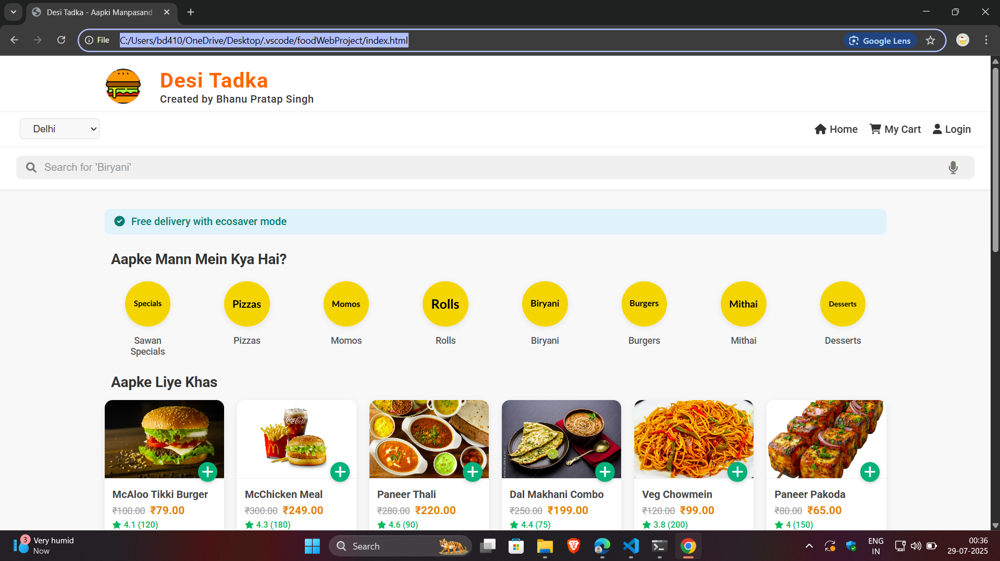
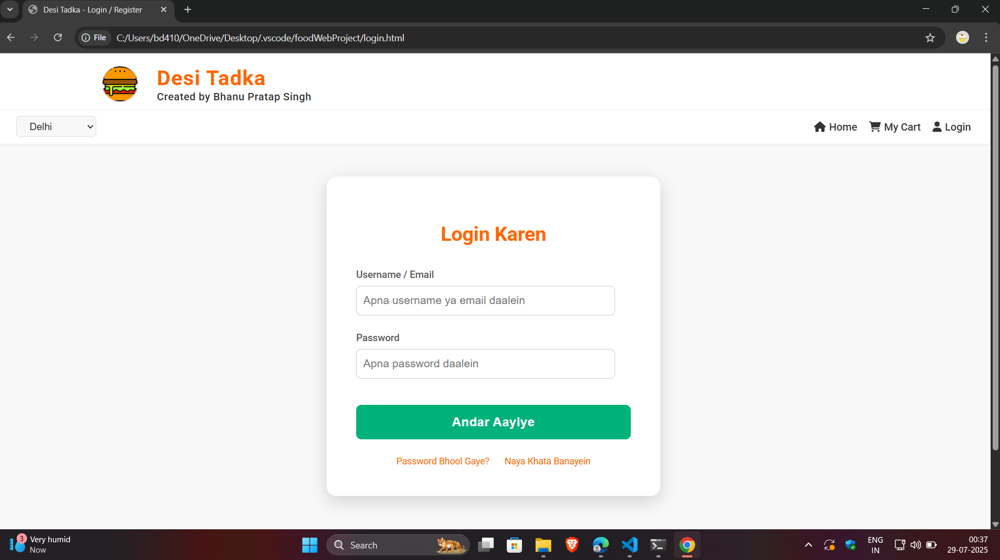
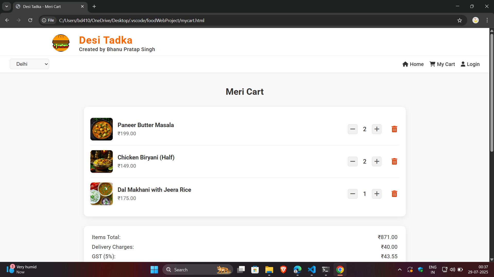
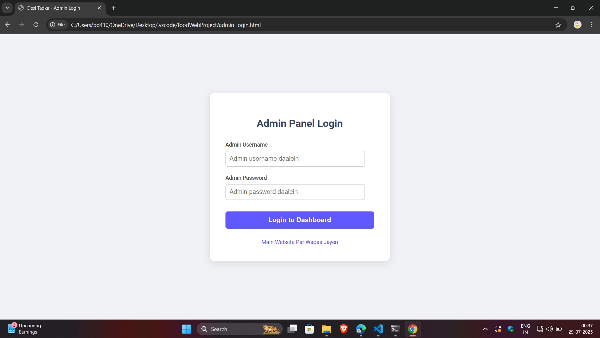

# foodWebProject
# 🍔 FoodWebProject

**FoodWebProject** is a frontend-only food ordering website built using pure HTML and CSS. This project is a UI prototype of a food delivery platform, where users can register, login, browse menus, add items to the cart, and view their profile.

> 🔗 **Live Demo**: [https://Bpsrj.github.io/foodWebProject/](https://Bpsrj.github.io/foodWebProject/)

---

## 📂 Project Structure

| File Name              | Description                                 |
|------------------------|---------------------------------------------|
| `index.html`           | Home page / landing page of the website     |
| `login.html`           | User login page                             |
| `register.html`        | New user registration page                  |
| `forgot-password.html` | Page to recover/reset forgotten password    |
| `mycart.html`          | Shopping cart showing selected food items   |
| `profile.html`         | User profile information page               |
| `admin.html`           | Admin dashboard (UI only)                   |
| `admin-login.html`     | Admin login page                            |
| `style.css`            | Main stylesheet for all pages               |
| `README.md`            | Project readme file                         |

---

## 🖼️ Screenshots

_Add your website screenshots below:_

---

## ⚙️ Features

- Responsive frontend pages
- Simple and clean UI
- Fully static (no backend logic)
- Admin and user login interfaces

---

## 🛠️ Tech Stack

- HTML5  
- CSS3  

---

## 📌 Note

This project is for educational and internship purposes only. It does not include backend or database functionality.

---

## 📬 Contact

Created with ❤️ by [**Bhanu Pratap Singh**](https://github.com/Bpsrj)
## 🖼️ Screenshots

### 🏠 Homepage

### 🔐 Login Page

### 🛒 My Cart Page

### 🛠️ Admin Dashboard

